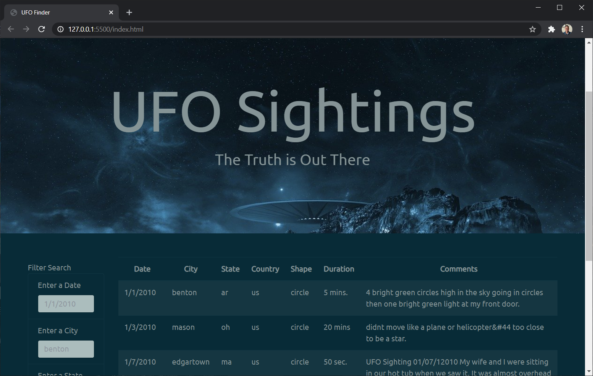

# javascript-challenge {Aliens-R-Real}

---
## Background & Challenge
WAKE UP SHEEPLE! The extra-terrestrial menace has come to Earth and we here at ALIENS-R-REAL have collected all of the eye-witness reports we could to prove it! All we need to do now is put this information online for the world to see and then the matter will finally be put to rest.

There is just one tiny problem though... our collection is too large to search through manually. Even our most dedicated followers are complaining that they are having trouble locating specific reports in this mess.

Write code that will create a table dynamically based upon a sourced UFO dataset. Web application should allow our users to filter the table data for specific values. Only use pure JavaScript, HTML, and CSS, and D3.js on the web pages. 

---
## Development Toolkit
* JavaScript
* d3.js
* HTML
* CSS

---
## Operating Instructions

>Clone repository, maintaing directory state

>Open index.html through preferred browser (i.e Chrome)

>Recommend review of data.js for variable values for filtering

>UFO-Level-1 Will Only filter on data (M/DD/YYYY)

>UFO-Level-2 Will filter on several string fields

---
## Application Screenshots

